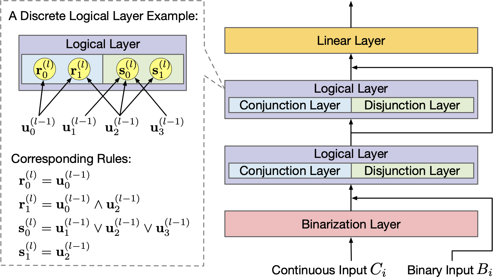
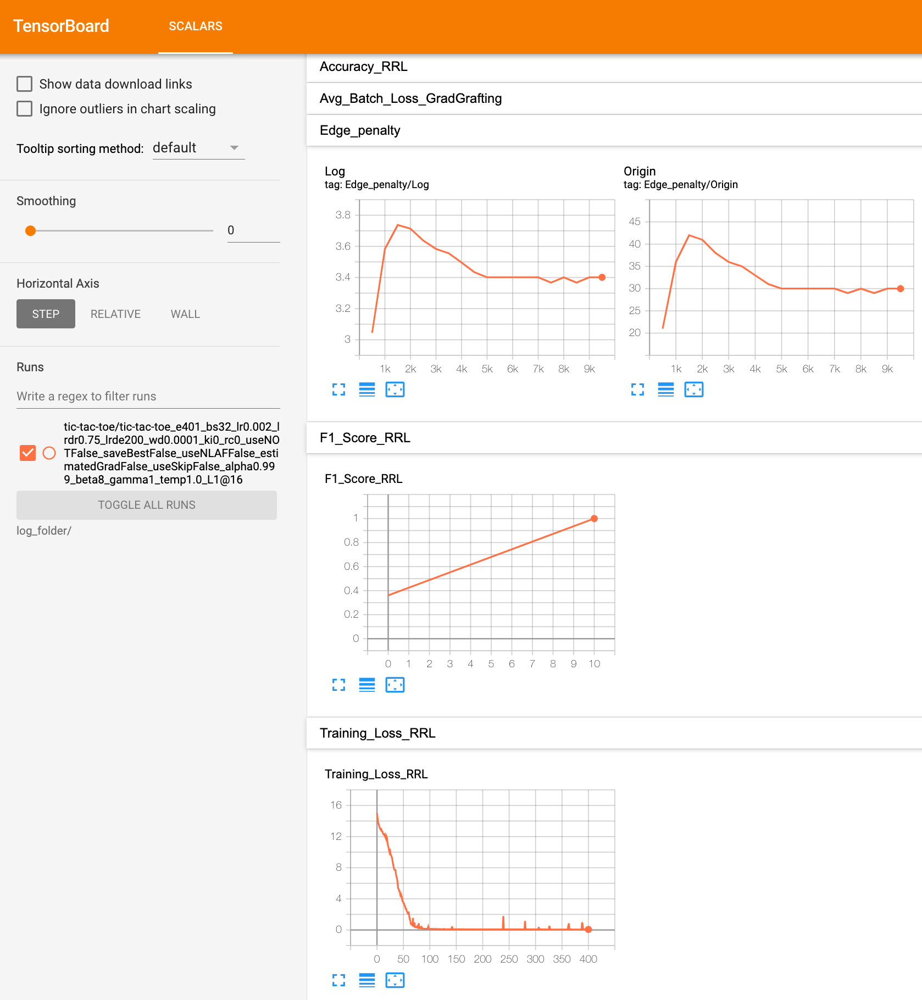

# Rule-based Representation Learner
## Updates
*The following updates have been summarized as a paper ([Learning Interpretable Rules for Scalable Data Representation and Classification](https://arxiv.org/abs/2310.14336)) and accepted by TPAMI.* :tada::tada::tada:

Compared with the previous version, we make the following significant updates to enhance RRL:
### Hierarchical Gradient Grafting
- The gradient-based discrete model training method proposed by the conference version, i.e., Single Gradient Grafting, is more likely to fail when the RRL goes deeper. 
- To tackle this problem and further improve the performance of deep RRL, we propose Hierarchical Gradient Grafting that can avoid the side effects caused by the multiple layers during training. 
### Novel Logical Activation Functions (NLAF)
- NLAFs not only can handle high-dimensional features that the original logical activation functions cannot handle but also are faster and require less GPU memory. Therefore, NLAFs are more scalable.
- Unfortunately, NLAF brings three additional hyperparameters, i.e., alpha, beta, and gamma. We recommend trying (alpha, beta, gamma) in {(0.999, 8, 1), (0.999, 8, 3), (0.9, 3, 3)}.
- To use NLAFs, you should set the "--use_nlaf" option and set hyperparameters by "--alpha", "--beta", and "--gamma". For example:
```bash
# trained on the tic-tac-toe data set with NLAFs.
python3 experiment.py -d tic-tac-toe -bs 32 -s 1@64 -e401 -lrde 200 -lr 0.002 -ki 0 -i 0 -wd 0.001 --nlaf --alpha 0.9 --beta 3 --gamma 3 --temp 0.01 --print_rule &
```

## Introduction
This is a PyTorch implementation of Rule-based Representation Learner (RRL) as described in NeurIPS 2021 paper
[Scalable Rule-Based Representation Learning for Interpretable Classification](https://arxiv.org/abs/2109.15103) and TPAMI paper [Learning Interpretable Rules for Scalable Data Representation and Classification](https://arxiv.org/abs/2310.14336).
<p align="center">
  
</p>
RRL aims to obtain both good scalability and interpretability, and it automatically learns interpretable non-fuzzy rules for data representation and classification. Moreover, RRL can be easily adjusted to obtain a trade-off between classification accuracy and model complexity for different scenarios.

## Requirements

* torch>=1.8.0
* torchvision>=0.9.0
* tensorboard>=1.15.0
* sklearn>=0.23.2
* numpy>=1.19.2
* pandas>=1.1.3
* matplotlib>=3.3.2
* CUDA>=11.1

## Run the demo
We need to put the data sets in the `dataset` folder. You can specify one data set in the `dataset` folder and train the model as follows:

```bash
# trained on the tic-tac-toe data set with one GPU.
python3 experiment.py -d tic-tac-toe -bs 32 -s 1@16 -e401 -lrde 200 -lr 0.002 -ki 0 -i 0 -wd 0.0001 --print_rule &
```
The demo reads the data set and data set information first, then trains the RRL on the training set. 
During the training, you can check the training loss and the evaluation result on the validation set by:

```bash
tensorboard --logdir=log_folder
```
<p align="center">
  
</p>

The training log file (`log.txt`) can be found in a folder created in `log_folder`. In this example, the folder path is 
```
log_folder/tic-tac-toe/tic-tac-toe_e401_bs32_lr0.002_lrdr0.75_lrde200_wd0.0001_ki0_rc0_useNOTFalse_saveBestFalse_useNLAFFalse_estimatedGradFalse_useSkipFalse_alpha0.999_beta8_gamma1_temp1.0_L1@16
```
After training, the evaluation result on the test set is shown in the file `test_res.txt`:
```
[INFO] - On Test Set:
        Accuracy of RRL  Model: 1.0
        F1 Score of RRL  Model: 1.0
```

Moreover, the trained RRL model is saved in `model.pth`, and the discrete RRL is printed in `rrl.txt`:

|RID|class_negative(b=-0.3224)|class_positive(b=-0.1306)|Support|Rule|
| ---- | ---- | ---- | ---- | ---- |
|(-1, 3)|-0.7756|0.9354|0.0885|3_x & 6_x & 9_x|
|(-1, 0)|-0.7257|0.8921|0.1146|1_x & 2_x & 3_x|
|(-1, 5)|-0.6162|0.4967|0.0677|2_x & 5_x & 8_x|
| ......| ...... | ...... | ...... | ...... |

#### Your own data sets

You can use the demo to train RRL on your own data set by putting the data and data information files in the `dataset` folder. Please read [DataSetDesc](dataset/README.md) for a more specific guideline.

#### Available arguments
List all the available arguments and their default values by:
```bash
$ python3 experiment.py --help
usage: experiment.py [-h] [-d DATA_SET] [-i DEVICE_IDS] [-nr NR] [-e EPOCH] [-bs BATCH_SIZE] [-lr LEARNING_RATE] [-lrdr LR_DECAY_RATE]
                     [-lrde LR_DECAY_EPOCH] [-wd WEIGHT_DECAY] [-ki ITH_KFOLD] [-rc ROUND_COUNT] [-ma MASTER_ADDRESS] [-mp MASTER_PORT]
                     [-li LOG_ITER] [--nlaf] [--alpha ALPHA] [--beta BETA] [--gamma GAMMA] [--temp TEMP] [--use_not] [--save_best] [--skip]
                     [--estimated_grad] [--weighted] [--print_rule] [-s STRUCTURE]

optional arguments:
  -h, --help            show this help message and exit
  -d DATA_SET, --data_set DATA_SET
                        Set the data set for training. All the data sets in the dataset folder are available. (default: tic-tac-toe)
  -i DEVICE_IDS, --device_ids DEVICE_IDS
                        Set the device (GPU ids). Split by @. E.g., 0@2@3. (default: None)
  -nr NR, --nr NR       ranking within the nodes (default: 0)
  -e EPOCH, --epoch EPOCH
                        Set the total epoch. (default: 41)
  -bs BATCH_SIZE, --batch_size BATCH_SIZE
                        Set the batch size. (default: 64)
  -lr LEARNING_RATE, --learning_rate LEARNING_RATE
                        Set the initial learning rate. (default: 0.01)
  -lrdr LR_DECAY_RATE, --lr_decay_rate LR_DECAY_RATE
                        Set the learning rate decay rate. (default: 0.75)
  -lrde LR_DECAY_EPOCH, --lr_decay_epoch LR_DECAY_EPOCH
                        Set the learning rate decay epoch. (default: 10)
  -wd WEIGHT_DECAY, --weight_decay WEIGHT_DECAY
                        Set the weight decay (L2 penalty). (default: 0.0)
  -ki ITH_KFOLD, --ith_kfold ITH_KFOLD
                        Do the i-th 5-fold validation, 0 <= ki < 5. (default: 0)
  -rc ROUND_COUNT, --round_count ROUND_COUNT
                        Count the round of experiments. (default: 0)
  -ma MASTER_ADDRESS, --master_address MASTER_ADDRESS
                        Set the master address. (default: 127.0.0.1)
  -mp MASTER_PORT, --master_port MASTER_PORT
                        Set the master port. (default: 0)
  -li LOG_ITER, --log_iter LOG_ITER
                        The number of iterations (batches) to log once. (default: 500)
  --nlaf                Use novel logical activation functions to take less time and GPU memory usage. We recommend trying (alpha, beta, gamma) in {(0.999, 8, 1), (0.999, 8, 3), (0.9, 3, 3)} (default: False)
  --alpha ALPHA         Set the alpha for NLAF. (default: 0.999)
  --beta BETA           Set the beta for NLAF. (default: 8)
  --gamma GAMMA         Set the gamma for NLAF. (default: 1)
  --temp TEMP           Set the temperature. (default: 1.0)
  --use_not             Use the NOT (~) operator in logical rules. It will enhance model capability but make the RRL more complex. (default: False)
  --save_best           Save the model with best performance on the validation set. (default: False)
  --skip                Use skip connections when the number of logical layers is greater than 2. (default: False)
  --estimated_grad      Use estimated gradient. (default: False)
  --weighted            Use weighted loss for imbalanced data. (default: False)
  --print_rule          Print the rules. (default: False)
  -s STRUCTURE, --structure STRUCTURE
                        Set the number of nodes in the binarization layer and logical layers. E.g., 10@64, 10@64@32@16. (default: 5@64)
```
## Citation

If our work is helpful to you, please kindly cite our paper as:

```
@article{wang2021scalable,
  title={Scalable Rule-Based Representation Learning for Interpretable Classification},
  author={Wang, Zhuo and Zhang, Wei and Liu, Ning and Wang, Jianyong},
  journal={Advances in Neural Information Processing Systems},
  volume={34},
  year={2021}
}
@article{wang2023learning,
  title={Learning Interpretable Rules for Scalable Data Representation and Classification},
  author={Wang, Zhuo and Zhang, Wei and Liu, Ning and Wang, Jianyong},
  journal={arXiv preprint arXiv:2310.14336},
  year={2023}
}
```

## License

[MIT license](LICENSE)
